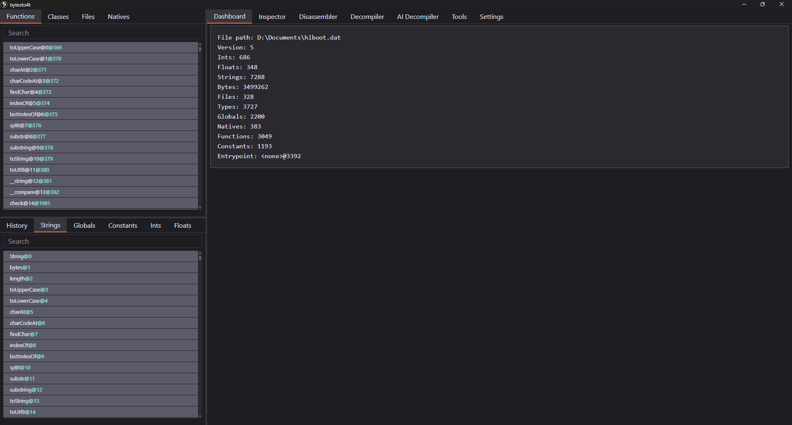
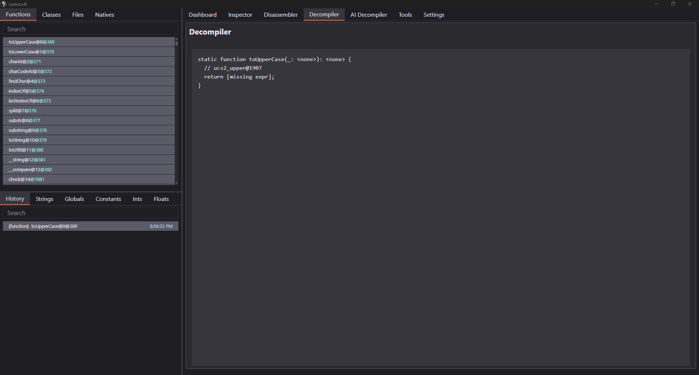

# hl-rev
[Hashlink](https://github.com/HaxeFoundation/hashlink) reversing tools.

Repository contains:
- bytesto4t - GUI app based on [hlbc](https://github.com/Gui-Yom/hlbc)
- HLBOOT.DAT.bt - template file for [010 Editor](https://www.sweetscape.com/010editor/)
- hlboot.hexpat - pattern file for [ImHex](https://github.com/WerWolv/ImHex)
- ce_scripts - [Cheat Engine](https://www.cheatengine.org/) scripts

# ByteSto4t
Simple application that allows you to see internals of `hlboot.dat` file.

  

    
    
    
    
    
    
    
    
  

Features:
- [hlbc](https://github.com/Gui-Yom/hlbc) Disassembler & Decompiler
- AI Decompiler (requires https://openrouter.ai/ account)
- Function recognizer - allows you to fill function addresses with function names
- Reference finder
- [ImHex](https://github.com/WerWolv/ImHex) Pattern Generator - allows you to build .hexpat for given Class
- Customizable Appearance. Available themes:
  - Skeleton
  - Wintry
  - Modern
  - Rocket
  - Seafoam
  - Vintage
  - Sahara
  - Hamlindigo
  - Gold Nouveau

Download [here](https://github.com/FirowMD/hl-rev/releases)