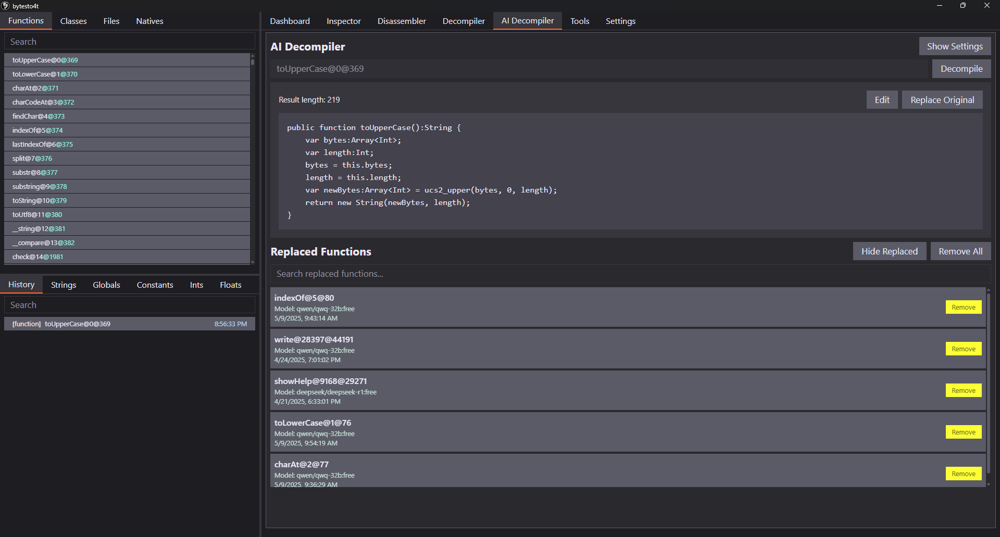
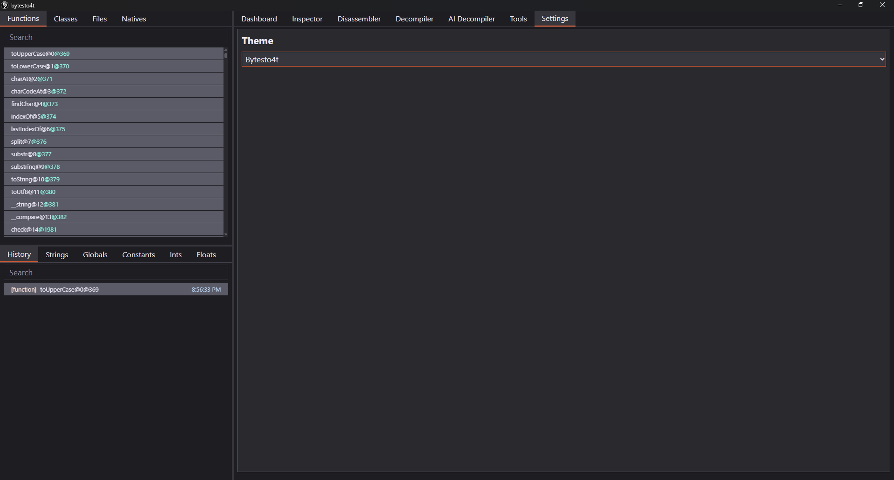

# ByteSto4t
Application that allows you to see internals of hashlink bytecode files: *.hl, `hlboot.dat`

  

    
    
    
    
    
    
    
    
  

Features:
- [hlbc](https://github.com/Gui-Yom/hlbc) Disassembler & Decompiler
- AI Decompiler (requires https://openrouter.ai/ account)
- Function recognizer - allows you to fill function addresses with function names
- X-References for Functions & Strings
- [ImHex](https://github.com/WerWolv/ImHex) Pattern Generator - allows you to build .hexpat for given Class
- Customizable Appearance