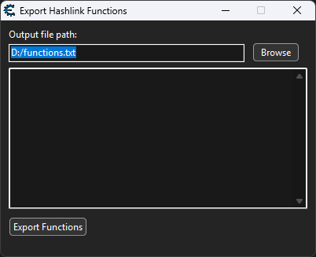

# Cheat Engine Scripts

## Installation

Place scripts in `autorun` folder, e.g. `C:\Program Files\Cheat Engine 7.5\autorun`.

Now, after launching Cheat Engine, you can show scripts under `Memory View` -> `Tools`.

## exportFunctions.lua

This script saves a list of function addresses that are translated from HashLink bytecode to native machine code.

You can use them in `bytesto4t` and Cheat Engine's `Code Filter` (or `Ultimap` for intel CPUs).

